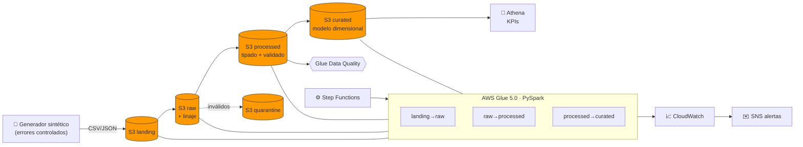
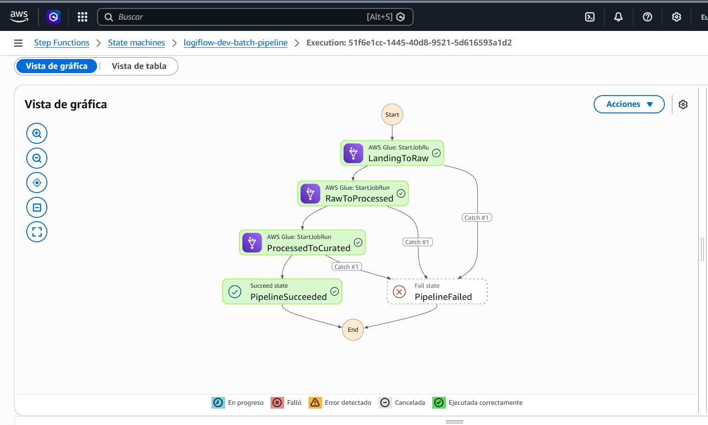
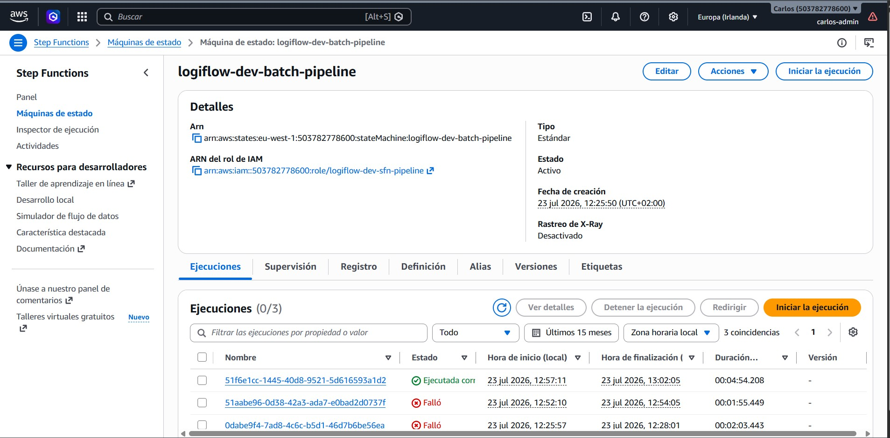
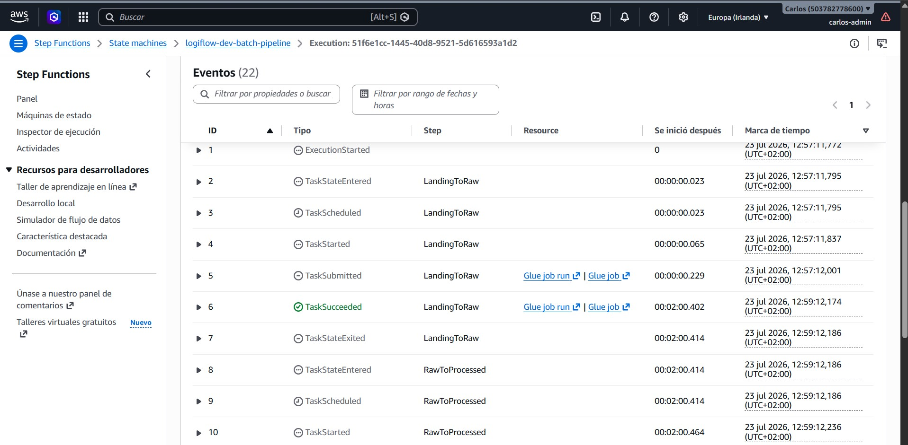

<div align="center">

# 🚚 LogiFlow AWS Data Platform

### Plataforma de ingeniería de datos *end-to-end* en AWS — de datos crudos a KPIs de negocio

Pipeline batch por capas, calidad de datos automatizada, orquestación *serverless* e infraestructura 100 % reproducible con Terraform.

<br>

[](https://github.com/CarlosGutierrezR/LogiFlow_AWS_Data_Platform/actions/workflows/ci.yml)


-E25A1C?logo=apachespark&logoColor=white)


</div>

---

## 📑 Tabla de contenidos

- [Resumen](#-resumen)
- [Arquitectura](#-arquitectura)
- [Capas del data lake](#-capas-del-data-lake)
- [Stack tecnológico](#-stack-tecnológico)
- [Calidad de datos](#-calidad-de-datos)
- [KPIs de negocio](#-kpis-de-negocio-athena)
- [Estructura del repositorio](#-estructura-del-repositorio)
- [Cómo ejecutar](#-cómo-ejecutar)
- [Pruebas](#-pruebas)
- [Seguridad](#-seguridad)
- [Control de costes](#-control-de-costes)
- [Roadmap](#-roadmap)
- [Documentación](#-documentación)
- [Autor](#-autor)

---

## 🎯 Resumen

**LogiFlow** es una empresa ficticia de logística que recibe a diario ficheros de pedidos y envíos desde sus sistemas operacionales. Necesita centralizarlos, garantizar su calidad y ofrecer indicadores fiables (tiempos de entrega, incidencias, rendimiento por ruta y almacén).

Este proyecto implementa esa plataforma de datos completa sobre AWS, siguiendo prácticas de un entorno empresarial real: **datos sintéticos con errores controlados → ingestión idempotente → data lake por capas → ETL con validación y cuarentena → modelo dimensional → KPIs en SQL**, todo definido como código y con integración continua.

> **Dominio:** logística y envíos · **Región:** eu-west-1 · **Estado:** núcleo batch desplegado, ejecutado y verificado en AWS.

---

## 🏗️ Arquitectura



**Flujo:** un único disparo de Step Functions ejecuta los tres jobs en orden (`landing→raw→processed→curated`) con esperas, reintentos y captura de fallos. La capa `raw` conserva el dato original con linaje; `processed` aplica esquemas explícitos, deduplica, valida y envía lo inválido a cuarentena; `curated` construye el modelo dimensional listo para analítica.

---

## 📸 El pipeline en ejecución

<div align="center">

**Orquestación en AWS Step Functions** — los tres jobs de Glue encadenados con `.sync`, reintentos y captura de fallos (`Catch → PipelineFailed`):



**Ejecuciones del state machine** — ejecución completa correcta en ~4:55 min (las dos fallidas corresponden a incidencias reales depuradas y documentadas en el runbook):



**Detalle de eventos** — traza paso a paso de la ejecución con `TaskSucceeded` y enlaces a cada Glue job run:



</div>

---

## 🗂️ Capas del data lake

| Capa | Contenido | Formato | Regla clave |
|:---|:---|:---|:---|
| 🟡 **landing** | Ficheros tal como llegan | CSV / JSON | Inmutable; entrada del pipeline |
| 🟠 **raw** | Copia + metadatos de linaje | Parquet particionado | Conserva **siempre** el dato original |
| 🔵 **processed** | Datos limpios, tipados, deduplicados | Parquet particionado | Solo lo que pasa calidad |
| 🟢 **curated** | Modelo dimensional (hechos + dimensiones) | Parquet particionado | Consumo por Athena / BI |
| 🔴 **quarantine** | Registros inválidos con su motivo | Parquet | Trazable y reprocesable |

Particionado por `ingest_date` en todas las capas. Cifrado SSE-S3, *Block Public Access* total y ciclo de vida para control de costes.

---

## 🧰 Stack tecnológico

<div align="center">

| Categoría | Tecnologías |
|:---:|:---|
| **Lenguajes** | Python · PySpark · SQL · HCL |
| **Almacenamiento** | Amazon S3 (5 capas) |
| **Catálogo & ETL** | AWS Glue 5.0 · Glue Crawlers · Glue Data Catalog |
| **Calidad** | AWS Glue Data Quality + validación propia |
| **Analítica** | Amazon Athena (workgroup dedicado) |
| **Orquestación** | AWS Step Functions |
| **Observabilidad** | Amazon CloudWatch · Amazon SNS |
| **Seguridad** | IAM (mínimo privilegio) · cifrado · Secrets vía entorno |
| **IaC** | Terraform (proveedor AWS ~> 6.0) |
| **CI/CD** | GitHub Actions · Ruff · Pytest |

</div>

---

## ✅ Calidad de datos

El proyecto aplica un **doble control**, cada uno con su rol:

1. **Validación propia en el ETL** — deduplicación por clave primaria, comprobación de obligatorios, enumeraciones, rangos, timestamps y coherencia temporal, e integridad referencial contra filas ya validadas. Lo inválido va a **cuarentena** con el motivo (`E01`–`E07`), nunca se descarta en silencio. Cada job hace **reconciliación estricta**: `raw = processed + quarantine + duplicados`, o falla.

2. **Verificación gestionada (Glue Data Quality)** — reglas declarativas sobre la capa `processed` que **deben pasar al 100 %**.

> 🧪 El generador inyecta errores conocidos y los registra en un manifiesto → el ETL los captura → Glue DQ certifica el resultado. Última evaluación: **Score 1.0, 7/7 reglas PASS**.

---

## 📊 KPIs de negocio (Athena)

Ejemplo de indicadores calculados con SQL sobre el modelo dimensional (`fact_shipments` + dimensiones):

**Rendimiento por transportista**

| carrier | envíos | coste medio (€) | retraso medio (h) |
|:---|---:|---:|---:|
| RapidCargo | 56 | 30,38 | 5,26 |
| TransIberia | 18 | 31,05 | 6,08 |
| EuroLink | 16 | 31,27 | 5,87 |
| LogiFast | 14 | 48,14 | 9,09 |

**Incidencias por almacén de origen**

| almacén | ciudad | envíos | incidencias | % incidencias |
|:---|:---|---:|---:|---:|
| WH-003 | Valencia | 24 | 8 | 33,3 % |
| WH-005 | Zaragoza | 28 | 8 | 28,6 % |
| WH-007 | Bilbao | 20 | 4 | 20,0 % |

Consultas completas en [`ops/athena_queries/kpis.sql`](ops/athena_queries/kpis.sql).

---

## 📁 Estructura del repositorio

```
.
├── .github/workflows/   # CI (ruff · pytest · terraform validate)
├── docs/                # Charter, arquitectura, ADRs, runbook, seguridad…
├── ops/
│   ├── glue_entries/    # Entry points de los jobs de Glue
│   └── athena_queries/  # Consultas KPI en SQL
├── src/
│   ├── data_generator/  # Generador de datos sintéticos con errores controlados
│   ├── ingestion/       # Subida idempotente a S3
│   └── etl/             # Jobs PySpark + esquemas del contrato
├── terraform/           # IaC: S3, Glue, Athena, Step Functions, SNS, IAM…
├── tests/               # Pytest (unitarios + integración PySpark)
└── README.md
```

---

## ▶️ Cómo ejecutar

**Requisitos:** AWS CLI autenticada (`aws login`), Terraform ≥ 1.9, Python 3.10+.

```bash
# 1. Desplegar la infraestructura
cd terraform
terraform init
terraform apply

# 2. Generar y subir datos de un día
python -m src.data_generator.main --date 2026-07-23 --output-dir data/local/landing
python -m src.ingestion.upload_landing --date 2026-07-23 --bucket <landing-bucket>

# 3. Ejecutar el pipeline completo (orquestado, un solo disparo)
SM=$(terraform -chdir=terraform output -raw sfn_pipeline_arn)
aws stepfunctions start-execution --state-machine-arn "$SM" \
  --input '{"ingest_date":"2026-07-23"}'
```

Procedimiento detallado, verificación e incidencias conocidas en [`docs/runbook.md`](docs/runbook.md).

---

## 🧪 Pruebas

```bash
pip install -r requirements-dev.txt
pytest tests/ -v          # unitarios (generador, ingestión, ETL, curated)
ruff check . && ruff format --check .
```

Los tests de PySpark requieren Java 11+ y `pip install "pyspark==3.5.*"` (mismo runtime que Glue 5.0); se omiten automáticamente si Spark no está instalado. El CI ejecuta lint, tests y `terraform validate` en cada push. Ver [`docs/testing.md`](docs/testing.md).

---

## 🔒 Seguridad

- **IAM de mínimo privilegio**: cada rol (crawlers, jobs, Step Functions) tiene acceso acotado a los recursos que necesita; sin comodines `*:*`.
- **Sin secretos en el repositorio**: `.gitignore` bloquea estado de Terraform, `*.tfvars` y `.env`. Las credenciales llegan del entorno (`aws login`), nunca incrustadas.
- **Cifrado en reposo** (SSE-S3) y **Block Public Access** total en todos los buckets.
- Detalle en [`docs/security.md`](docs/security.md).

---

## 💰 Control de costes

Diseñado para **coste casi nulo** con datos sintéticos: solo servicios *serverless* de pago por uso (S3, Glue, Athena, Step Functions), sin recursos de coste fijo (NAT, RDS, Redshift…). Un **presupuesto de gasto cero** avisa al primer céntimo, los crawlers y jobs se ejecutan **bajo demanda**, los resultados de Athena expiran a los 7 días y todo es **destruible** con `terraform destroy`. Ver [`docs/cost-control.md`](docs/cost-control.md).

---

## 🗺️ Roadmap

| # | Fase | Estado |
|:---:|:---|:---:|
| 0 | Fundación del repositorio | ✅ |
| 1 | Cuenta AWS segura (MFA, presupuesto, CLI) | ✅ |
| 2 | Bootstrap Terraform | ✅ |
| 3 | Capa de almacenamiento S3 | ✅ |
| 4 | Contratos de datos + generador sintético | ✅ |
| 5 | Ingestión a S3 + catalogación | ✅ |
| 6 | ETL PySpark (landing→raw→processed) | ✅ |
| 7 | Calidad de datos (Glue DQ + cuarentena) | ✅ |
| 8 | Modelo dimensional (curated) + Athena | ✅ |
| 9 | Orquestación con Step Functions | ✅ |
| 10 | Observabilidad (CloudWatch + SNS) | ✅ |
| 11 | GitHub + CI/CD | ✅ |
| 12 | Cierre: costes reales + destrucción controlada | ✅ |
| 13+ | Extensiones: streaming, Iceberg, Redshift, QuickSight | 🧭 |

---

## 📚 Documentación

| Documento | Contenido |
|:---|:---|
| [project-charter](docs/project-charter.md) | Objetivo, alcance y criterios de éxito |
| [architecture](docs/architecture.md) | Arquitectura y componentes |
| [data-contracts](docs/data-contracts.md) | Esquemas, reglas y taxonomía de errores |
| [decisions](docs/decisions.md) | Decisiones arquitectónicas (ADR) |
| [runbook](docs/runbook.md) | Ejecución, despliegue e incidencias resueltas |
| [security](docs/security.md) | Seguridad y gestión de credenciales |
| [cost-control](docs/cost-control.md) | Control de costes |
| [testing](docs/testing.md) | Estrategia y estado de las pruebas |
| [roadmap](docs/roadmap.md) · [changelog](docs/changelog.md) | Fases, estado y registro con evidencias |

---

<div align="center">

## 👤 Autor

**Carlos Alberto Gutiérrez Rondón** — Data Engineer

Ingeniero de Sistemas · Máster en Ingeniería Informática (UGR)

[](https://www.linkedin.com/in/carlosgutierrez-rondon)
[](https://github.com/CarlosGutierrezR)

<sub>Proyecto de portafolio · datos sintéticos · sin datos reales ni sensibles</sub>

</div>
