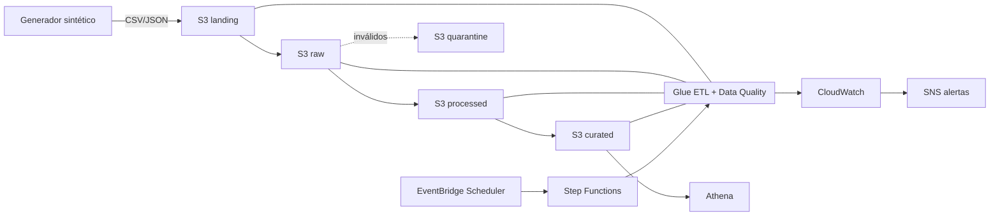

# Arquitectura — LogiFlow AWS Data Platform

Estado: diseño objetivo. Ningún recurso desplegado todavía.

## Capas de almacenamiento (S3)

| Capa | Contenido | Formato | Regla |
|---|---|---|---|
| landing | Ficheros tal como llegan de la fuente | CSV/JSON original | Inmutable; entrada del pipeline |
| raw | Copia validada estructuralmente, particionada por fecha de ingesta | Original + metadatos de ingesta | Conserva el dato original siempre |
| processed | Datos limpios, tipados, deduplicados | Parquet particionado | Solo datos que pasan calidad; inválidos → cuarentena |
| curated | Modelo analítico (hechos y dimensiones) | Parquet particionado | Consumo por Athena/BI |
| quarantine | Registros que fallan validaciones | Formato de origen + motivo | Trazable y reprocesable |

## Componentes del núcleo batch

- **Generador de datos sintéticos** (Python): pedidos, envíos, rutas, almacenes con errores controlados para probar calidad.
- **Glue Data Catalog + crawlers**: esquemas y particiones.
- **Glue ETL (PySpark)**: landing→raw→processed→curated, incremental e idempotente.
- **Glue Data Quality**: reglas por dataset (ver ADR-002: disponibilidad regional pendiente de verificar).
- **Athena**: validación y consulta del modelo dimensional.
- **Step Functions + EventBridge Scheduler**: orquestación y planificación.
- **CloudWatch + SNS**: métricas, logs estructurados y alertas.
- **IAM + KMS + Secrets Manager**: mínimo privilegio, cifrado, secretos fuera del código.
- **Terraform**: toda la infraestructura. **GitHub Actions**: CI/CD al publicar el repo.

## Principios aplicados

Idempotencia, procesamiento incremental, esquemas explícitos con evolución controlada, particionamiento por fecha, formatos columnares, deduplicación, reconciliación de conteos entre capas, zona de cuarentena, reintentos, logging estructurado, linaje documentado.

## Diagrama

## Extensiones (post-núcleo)

Kinesis/Firehose/Lambda (streaming), Lake Formation, Redshift Serverless, QuickSight, RDS+DMS, Apache Iceberg. Cada una requerirá su propio ADR con justificación de coste.
